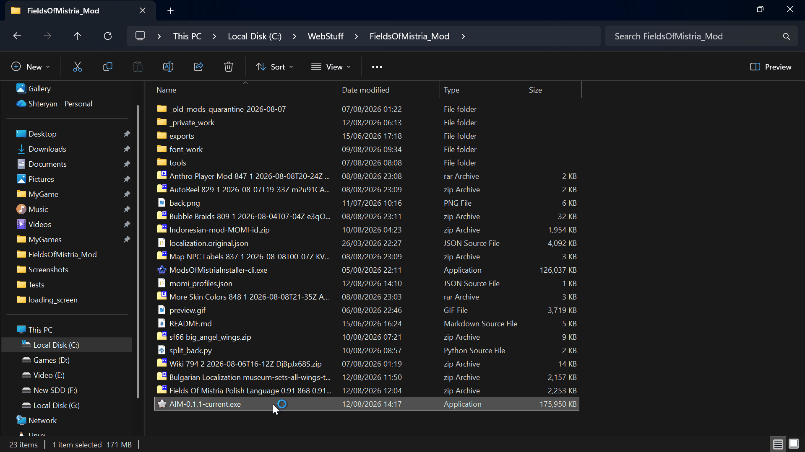

# AIM — Alternative Installer for Mistria 0.1.1

This is an independently maintained alternative installer for **Fields of Mistria 1.0.x**, based on the open-source **Mods of Mistria Installer (MOMI)** project.

AIM is a fork of MOMI. It was renamed to avoid confusion between the two applications while preserving the upstream history, attribution, and technical compatibility. AIM is not affiliated with or endorsed by the original MOMI project.

AIM is not intended to replace MOMI. It exists to provide capabilities that are currently needed by this fork while remaining compatible with the upstream project. If MOMI later adopts at least the capabilities that motivated this fork and fully meets the project's needs, AIM may be retired in favour of the upstream project.

The current AIM application version is `0.1.1`.

## Preview



This is only a visual preview of AIM. It is not part of the application build or release package.

## Fork-specific improvements

Compared with the upstream 0.15.1 line, this fork focuses on Fields of Mistria 1.0.x support and safer everyday use:

- Rebuilds are staged from a verified pristine archive and validated before the live `assets.zip` is replaced.
- Failed installations keep the previous working archive and provide a mod-specific diagnostic log where possible.
- TOML validation, custom font installation and manual-load animation content are supported for current 1.0.x mods.
- The UI remembers profiles and load order, behaves better on high-DPI displays, and includes a guarded **Play** button.
- Update checks, release uploads and the GitHub link belong to this fork rather than the upstream repository.

## What this fork supports

- Fields of Mistria 1.0.x mod installations.
- Mod folders, ZIP archives, and RAR archives containing either `manifest.toml` or `manifest.json`.
- ZIP and RAR mods are read directly by AIM; extracting them first is optional. The manifest must be at the archive's mod root.
- TOML, JSON, image, outfit, furniture, item, object, store, shadow, font and manual-load mod content supported by the current AIM installer modules.
- GML mods using the MMAPI format documented in [`docs/MMAPI`](docs/MMAPI); MMAPI compatibility is retained from the upstream project.
- Profiles and persisted mod load order.
- Rebuilding `assets.zip` from a verified pristine backup, so disabled or removed mods are removed on the next successful rebuild.
- Staged installation diagnostics, archive validation and recovery when an installation fails.
- A Play button that is available when the game can be launched, including before any mod is installed.
- Play uses Steam by default. Enable **Launch game directly** from the gear menu to launch the detected `FieldsOfMistria.exe` instead; the preference is saved between launches and falls back to Steam if direct launching is unavailable.

This project is intended for Fields of Mistria 1.0.x. Individual mods may still require a specific AIM version or game patch; check the mod author's compatibility notes.

## Installation

1. Download the latest release from the [AcTePuKc fork releases page](https://github.com/AcTePuKc/Mods-of-Mistria-Installer/releases).
2. Create or select a mods folder. AIM automatically checks the game directory and the directory containing the AIM executable; `mods`, `Mods`, `MODS`, and `MODs` are accepted. On Linux/Steam Deck it also checks the supported per-user `mistria-mods` locations. A manually selected folder may be elsewhere.
3. Put each mod directly in the selected mods folder. A mod folder, ZIP archive, or RAR archive must contain `manifest.toml` or `manifest.json` at its mod root; nested duplicate folders prevent detection.
   **Important:** Keep only one copy of a given mod in the active folder. When an updated version is added while the older copy remains, AIM does not yet guarantee that it will select the newer copy; the old version may remain the one that is discovered or installed. Close AIM before moving, replacing, or deleting the old copy, because an open mod archive may be locked by the application. Do not leave the same mod there both as an extracted folder and as a ZIP/RAR archive, because AIM may discover both copies.
4. Start AIM, select the mods to install, and click **Install**.
5. Use **Play** whenever the game is ready to launch. Installing mods is optional; after an installation attempt, wait for it to complete before starting the game.

AIM preserves a pristine backup and writes a staged archive before replacing the live `assets.zip`. Do not delete the backup while AIM is managing the installation. Keep a separate game backup before testing unfamiliar mods.

## Updating the game

After a Fields of Mistria update, start AIM and reinstall the enabled mods. When the new `assets.zip` is a valid vanilla archive and the game executable also changed, AIM automatically adopts it as the new pristine source; no manual `assets.bak.zip` creation is required. AIM keeps the previous backup with a timestamped name until the update is accepted. If the archive is damaged or the update cannot be verified, AIM preserves the existing backup and asks you to verify the game files through Steam. Mods made for an older game or installer version may still need to be updated by their authors.

## Troubleshooting

- If the game location is not detected, place AIM next to `Maybe.toml` or select the game directory in Settings.
- If no mods appear, check that AIM is looking at the intended mods folder, that the manifest is at the mod root, and that the mod supports Fields of Mistria 1.0.x. The folder may be next to the game, next to AIM, or selected manually.
- If installation fails, AIM keeps the previous live archive, shows the failing mod when available, and writes a diagnostic log under the AIM local data directory.
- If the game was modified outside AIM or the pristine backup is missing, restore/verify the game files through Steam before trying again.

For bugs and fork-specific support, use the [fork issue tracker](https://github.com/AcTePuKc/Mods-of-Mistria-Installer/issues). The upstream project and its documentation remain available at [Garethp/Mods-of-Mistria-Installer](https://github.com/Garethp/Mods-of-Mistria-Installer).

## Development

Build the solution with .NET 8:

```powershell
dotnet build ModsOfMistriaInstaller.sln --configuration Release
dotnet test ModsOfMistriaInstaller.sln --configuration Release
```

The release workflow builds the GUI and CLI for the supported desktop targets and uploads artifacts only to releases in this fork. Nexus publishing is manual and is not triggered by a normal GitHub release.

The repository does not include game archives or copyrighted game localization data.
